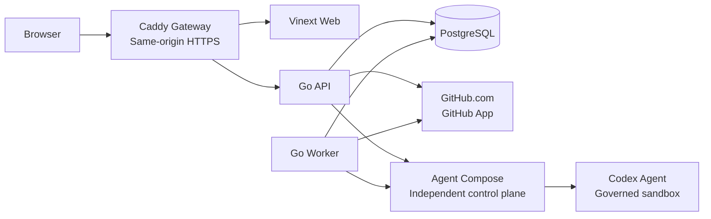
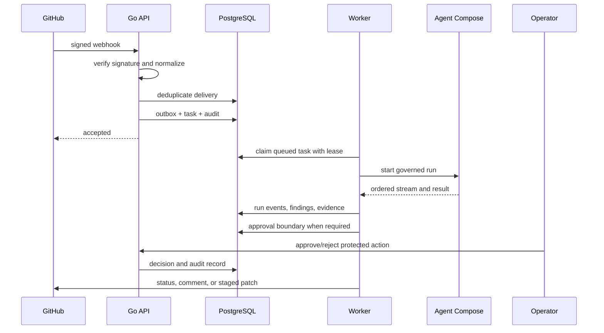

# RepoMender Technical Architecture

Updated: 2026-08-07

## 1. Positioning and boundaries

RepoMender is a self-hosted, single-tenant engineering automation platform for code review, CI diagnosis, issue repair, approval governance, and automation administration. It keeps repository policy, task state, approvals, audit history, and evidence in its own control plane, while Agent Compose (AC) remains an independent governed execution plane.

Current first-release boundaries:

- GitHub.com is the active SCM scope; the GitLab adapter is preserved but disabled by default.
- The deployment is self-hosted and single-tenant. Billing, multi-tenancy, GHES, and automatic merge are out of scope.
- Agent Compose/Codex credentials are not copied into or persisted by RepoMender.
- Business modules are exposed only after their sequential M0 → M1 → M2 → M3… acceptance gates pass.

## 2. System topology



The production gateway exposes one origin: `/api/*`, `/health/*`, and `/webhooks/*` are proxied to the Go API, while all other requests go to the Web service. The API and worker are separate commands of the same Go binary. PostgreSQL is the only durable store and is also the foundation for the MVP task queue and transactional Outbox.

## 3. Runtime components

| Component | Implementation | Responsibility |
| --- | --- | --- |
| Gateway | Caddy | Same-origin routing, HTTPS termination, compression, and ingress boundary |
| Web | Vinext / React | Console, identity, task/run, approval, and administration views |
| API | Go `repomender api` | HTTP API, authentication, webhooks, synchronous writes, health checks |
| Worker | Go `repomender worker` | Lease-based task claims, execution adapters, events, and result persistence |
| Migration | Go `repomender migrate` | Embedded SQL upgrades/rollback with an advisory lock |
| Retention | Go `repomender retention` | M10 history cleanup while preserving pending Outbox state |
| PostgreSQL | PostgreSQL 16 | Identity, SCM, tasks, runs, evidence, approvals, audit, and Outbox |
| SCM adapter | `internal/scm` | GitHub App, repository snapshots, webhook verification, status/comment/patch boundary |
| AC adapter | `internal/execution/agentcompose` | Health, start, streaming events, cancellation, result protocol, and error normalization |

## 4. Code boundaries

```text
app/                         Web pages and interaction components
server/cmd/repomender        API, worker, migration, health, and retention entrypoints
server/internal/config       REPOMENDER_* configuration parsing and validation
server/internal/httpserver   Routing, auth middleware, CSRF, RBAC, and SSE
server/internal/auth         Local bootstrap, OIDC, sessions, and one-time flows
server/internal/scm          Provider-neutral SCM service and GitHub/GitLab adapters
server/internal/execution    Execution control-plane abstraction
server/internal/tasks        State machine, leases, run events, audit, and evidence
server/internal/review       M5 code-review processor
server/internal/diagnosis    M6 CI-diagnosis processor
server/internal/approvals    M7 approval policy, decisions, and consumption
server/internal/repair       M8 repair plans, patch safety, and publish stages
server/internal/automations  M9 templates, budgets, triggers, and administration
server/internal/metrics      M10 Prometheus-style metrics
server/internal/ratelimit    M10 request rate limiting
server/internal/telemetry    M10 traceparent / X-Request-ID propagation
server/internal/retention    M10 history-retention policy
server/internal/worker       Queue loop and task-kind processor dispatch
server/internal/database     PostgreSQL connections, migrations, and transactions
```

Business code depends on provider-neutral interfaces rather than GitHub or AC business SDKs. Adapters own protocol conversion, credential boundaries, and error normalization; task, approval, and audit services operate on stable domain types.

## 5. Key data flows

### 5.1 SCM event to governed task



Webhook delivery IDs, task `source_key`, run IDs, and approval `idempotency_key` provide idempotency at their respective boundaries. PostgreSQL is written before external notification is delivered; the Outbox prevents a successful API response from losing a required external side effect.

### 5.2 Agent Compose boundary

RepoMender stores only the AC address, optional Bearer token, version/driver constraints, and timeout settings. An execution request carries the repository, immutable commit SHA, prompt, resource policy, and versioned payload. ConnectRPC stream frames are normalized into RepoMender log, status, and terminal events. Timeout, cancellation, stream loss, sandbox failure, and agent failure map to stable error codes.

## 6. Database and migrations

- SQL migrations are embedded in the Go binary and recorded in `schema_migrations`.
- API and worker startup may attempt migrations concurrently; a transaction-scoped advisory lock permits only one migration runner.
- Every `.up.sql` must have a matching `.down.sql`. Unit tests verify pairing/order, while PostgreSQL integration tests verify repeatable upgrade, rollback, and upgrade again.
- Task claims use `FOR UPDATE SKIP LOCKED`. An expired lease terminates the old run and creates the next attempt; the stale worker cannot complete the replacement lease.
- Retention removes historical run events, audit, webhook, and completed Outbox records. Pending/failed Outbox records are operational state and are retained.

## 7. Trust boundaries and security controls

1. Browser and gateway: cookie sessions, CSRF, same-origin routing, security response headers, and HTTPS/HSTS.
2. API and PostgreSQL: parameterized SQL, transactional state transitions, audit records, encrypted persisted credentials, and minimized response fields.
3. API and GitHub: GitHub App private keys are read only from environment/mounted files; webhooks are verified before normalization and deduplication.
4. API/worker and AC: the AC token is outbound-only and never enters task events, SSE, or REST responses; sensitive patterns are redacted at logging and result boundaries.
5. AC and Codex sandbox: the independent Agent Compose control plane owns execution driver, project secrets, network, and tool permissions; RepoMender does not bypass it to launch an agent directly.

M10 adds security headers, request IDs, W3C `traceparent`, Prometheus-style metrics, and per-minute rate limiting at the API boundary. `/health/live` only proves process responsiveness; `/health/ready` checks PostgreSQL and enabled external dependencies so dependency outages do not trigger unnecessary restarts.

## 8. Feature flags and delivery sequence

| Module | Domain | Main switch |
| --- | --- | --- |
| M0 | Engineering foundation | Enabled by default |
| M1 | Identity and access | OIDC / local bootstrap configuration |
| M2 | SCM and repositories | `REPOMENDER_FEATURE_M2_SCM` |
| M3 | AC execution | `REPOMENDER_FEATURE_M3_AC_EXECUTION` |
| M4 | Tasks and audit | `REPOMENDER_FEATURE_M4_TASKS` |
| M5 | Code review | `REPOMENDER_FEATURE_M5_CODE_REVIEW` |
| M6 | CI diagnosis | `REPOMENDER_FEATURE_M6_CI_DIAGNOSIS` |
| M7 | Approval governance | `REPOMENDER_FEATURE_M7_APPROVALS` |
| M8 | Issue repair | `REPOMENDER_FEATURE_M8_ISSUE_REPAIR` |
| M9 | Automation administration | `REPOMENDER_FEATURE_M9_AUTOMATIONS` |
| M10 | Enterprise delivery hardening | `REPOMENDER_FEATURE_M10_HARDENING` |

Business modules are accepted sequentially. M5, M6, and M8 require M3 AC execution. A disabled module must not create external side effects through UI, webhook, or worker registration paths.

## 9. Deployment, upgrades, and operations

```bash
cp .env.example .env
docker compose up --build
docker compose config --quiet
```

The upgrade sequence is: backup → pull a pinned image/code version → start API/worker so embedded migrations run → check `/health/ready` → verify metrics, version, and queue behavior. `scripts/backup.sh` uses a custom-format `pg_dump`, a private temporary file, and atomic replacement. `scripts/restore.sh` requires `CONFIRM_RESTORE=YES` and uses `pg_restore --clean --exit-on-error`.

Production deployments should supply database, OIDC, GitHub App, AC token, and master-key values through an external secret manager. Never commit real private keys, tokens, or `.env` files.

## 10. Test and CI architecture

GitHub Actions runs on pull requests and pushes to `main`:

- frontend ESLint, TypeScript, Vinext build, and SSR rendering regression;
- Go race tests, `go vet`, and a repository coverage gate currently set to 35%;
- PostgreSQL migration/auth/SCM/tasks/approvals/repair/automations/retention integration tests;
- backup/restore safety regression;
- base, SCM, and M6-M10 Compose overlay validation;
- Go API and Web container builds;
- npm audit and pull-request dependency review.

The frontend audit currently reports high-severity advisories in the existing dependency chain, so it is advisory until a compatibility-scoped dependency upgrade is completed. See the [project review](../review/PROJECT-REVIEW-2026-08.md) for details.

Useful local commands:

```bash
npm run verify
make backend-test
make backend-coverage
make backend-integration   # requires TEST_DATABASE_URL
make ops-test
```

## 11. Decisions and future evolution

- PostgreSQL provides persistence, the task queue, and the Outbox to minimize MVP dependencies. A higher-throughput queue can replace the implementation behind `tasks.Store`/Outbox boundaries.
- AC remains an independent control plane to isolate agent, model, and secret permissions from RepoMender.
- M10 tracing is dependency-free W3C propagation at the boundary; a full OpenTelemetry exporter requires a separate compatibility and operations review.
- Frontend coverage currently includes SSR and source wiring regression. The next milestone is browser interaction, API failure-state, and accessibility snapshot testing, followed by removal of static design-review fallbacks.

Related documents: [Chinese architecture](TECHNICAL-ARCHITECTURE.md), [M10 runbook](../operations/M10-RUNBOOK.md), [M0 foundation](M00-foundation.md), and [M3 AC contract](M03-agent-compose-contract.md).
