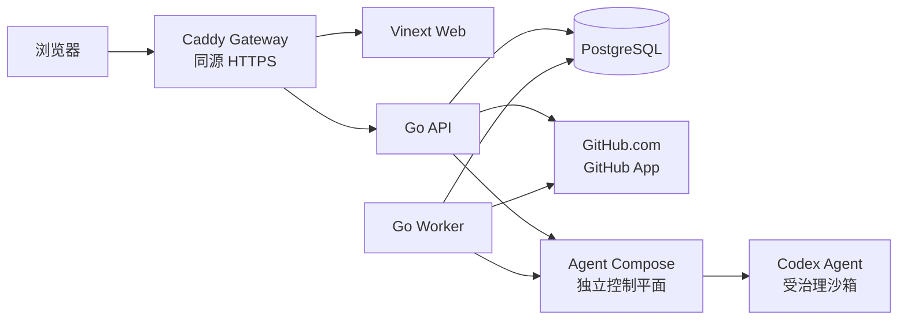
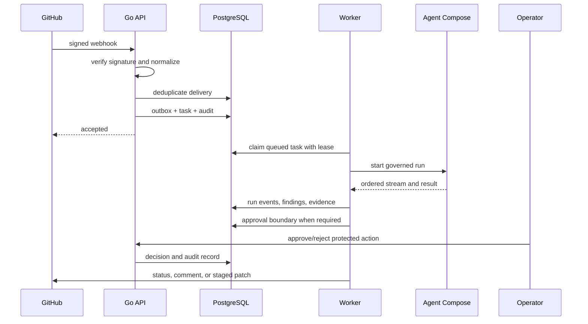

# RepoMender 技术架构

更新时间：2026-08-07

## 1. 定位与边界

RepoMender 是面向工程团队的自托管、单租户工程自动化平台，负责代码审查、CI 诊断、Issue 修复、审批治理和自动化管理。它把仓库策略、任务状态、审批、审计和证据保存在自己的控制平面中，把 Agent Compose（AC）作为独立的受治理执行平面。

当前首发边界：

- 支持 GitHub.com；GitLab 适配器保留但默认关闭。
- 单租户、自托管部署，不包含计费、多租户、GHES 和自动合并。
- Agent Compose/Codex 凭据不复制到 RepoMender，不由 RepoMender 持久化模型密钥。
- 业务模块按 M0 → M1 → M2 → M3… 顺序通过验收后，才由 feature flag 暴露。

## 2. 总体拓扑



生产部署通过 Gateway 暴露单一来源：`/api/*`、`/health/*` 和 `/webhooks/*` 转发到 Go API，其余请求转发到 Web。API 和 Worker 使用同一个 Go 二进制的不同命令运行；PostgreSQL 是唯一持久化存储，也是 MVP 任务队列和事务 Outbox 的基础。

## 3. 运行时组件

| 组件 | 实现 | 职责 |
| --- | --- | --- |
| Gateway | Caddy | 同源路由、HTTPS 终止、压缩和入口边界 |
| Web | Vinext / React | 控制台、登录、任务/运行/审批/管理页面 |
| API | Go `repomender api` | HTTP API、认证、Webhook、同步写入、健康检查 |
| Worker | Go `repomender worker` | 租约式领取任务、执行适配器、事件和结果持久化 |
| Migration | Go `repomender migrate` | 嵌入式 SQL 的升级/回滚，使用 advisory lock 串行化 |
| Retention | Go `repomender retention` | M10 历史数据清理，保留待处理 Outbox 状态 |
| PostgreSQL | PostgreSQL 16 | 身份、SCM、任务、运行、证据、审批、审计、Outbox |
| SCM adapter | `internal/scm` | GitHub App、仓库快照、Webhook 验证、状态/评论/补丁边界 |
| AC adapter | `internal/execution/agentcompose` | 健康、启动、流式事件、取消、结果协议和错误归一化 |

## 4. 代码边界

```text
app/                         Web 页面和交互组件
server/cmd/repomender        API、Worker、迁移、健康和 retention 入口
server/internal/config       REPOMENDER_* 配置解析和校验
server/internal/httpserver   路由、认证中间件、CSRF、RBAC、SSE
server/internal/auth         本地管理员、OIDC、会话和一次性流程
server/internal/scm          provider-neutral SCM 服务和 GitHub/GitLab 适配器
server/internal/execution    执行控制平面抽象
server/internal/tasks        任务状态机、租约、运行事件、审计和证据
server/internal/review       M5 代码审查处理器
server/internal/diagnosis    M6 CI 诊断处理器
server/internal/approvals    M7 审批策略、决定和消费
server/internal/repair       M8 Issue 修复计划、补丁安全和发布阶段
server/internal/automations  M9 模板、预算、触发器和管理接口
server/internal/metrics      M10 Prometheus 风格指标
server/internal/ratelimit    M10 请求限流
server/internal/telemetry    M10 traceparent / X-Request-ID 边界传播
server/internal/retention    M10 历史数据保留策略
server/internal/worker       队列循环和按任务类型的处理器分发
server/internal/database     PostgreSQL 连接、迁移和事务边界
```

业务代码依赖 provider-neutral 接口，不直接依赖 GitHub 或 AC 的业务 SDK。适配器负责协议转换、凭据边界和错误归一化；任务、审批和审计服务只处理稳定的领域类型。

## 5. 关键数据流

### 5.1 SCM 事件到任务



Webhook delivery ID、任务 `source_key`、运行 ID 和审批 `idempotency_key` 构成不同边界的幂等键。持久化状态先写入 PostgreSQL，再由 Outbox 驱动外部通知，避免 API 响应成功但外部副作用丢失。

### 5.2 AC 执行边界

RepoMender 只保存 AC 的地址、可选 Bearer token、版本/driver 约束和超时配置。执行请求携带仓库、不可变 commit SHA、提示词、资源策略和版本化 payload。AC 返回的 ConnectRPC 流被转换为 RepoMender 的日志、状态和终端事件；超时、取消、断流、沙箱失败和 Agent 失败会映射为稳定错误码。

## 6. 数据库与迁移

- SQL 迁移嵌入 Go 二进制，记录在 `schema_migrations`。
- API 和 Worker 启动时可以并发尝试迁移；事务级 advisory lock 保证只有一个执行者应用变更。
- 每个 `.up.sql` 必须有匹配的 `.down.sql`，迁移测试验证配对和顺序；PostgreSQL 集成测试验证重复升级、回滚和再次升级。
- 任务领取使用 `FOR UPDATE SKIP LOCKED`；租约过期会终止旧运行并创建下一次 attempt，旧 Worker 不能完成新租约。
- Retention 只清理历史运行事件、审计、Webhook 和已完成 Outbox；pending/failed Outbox 属于运行状态，不自动删除。

## 7. 信任边界与安全控制

1. 浏览器与 Gateway：Cookie 会话、CSRF、同源路由、安全响应头和 HTTPS/HSTS。
2. API 与 PostgreSQL：参数化 SQL、事务状态机、审计记录、加密持久化凭据和最小化返回字段。
3. API 与 GitHub：GitHub App 私钥只从环境/挂载文件读取；Webhook 先验签、再规范化和去重。
4. API/Worker 与 AC：AC token 只用于出站请求，不进入任务事件、SSE 或 REST 响应；敏感模式在日志和结果边界脱敏。
5. AC 与 Codex 沙箱：由独立 Agent Compose 控制执行驱动、项目 secret、网络和工具权限；RepoMender 不绕过该控制平面直接启动 Agent。

M10 在 API 边界增加安全响应头、请求 ID、W3C traceparent、Prometheus 指标和每分钟限流。`/health/live` 只代表进程可响应；`/health/ready` 才检查数据库及启用的外部依赖，避免依赖故障触发不必要的重启。

## 8. 模块开关与交付顺序

| 模块 | 领域 | 主要开关 |
| --- | --- | --- |
| M0 | 工程基础 | 默认启用 |
| M1 | 身份与访问 | OIDC / local bootstrap 配置 |
| M2 | SCM 与仓库 | `REPOMENDER_FEATURE_M2_SCM` |
| M3 | AC 执行 | `REPOMENDER_FEATURE_M3_AC_EXECUTION` |
| M4 | 任务与审计 | `REPOMENDER_FEATURE_M4_TASKS` |
| M5 | 代码审查 | `REPOMENDER_FEATURE_M5_CODE_REVIEW` |
| M6 | CI 诊断 | `REPOMENDER_FEATURE_M6_CI_DIAGNOSIS` |
| M7 | 审批治理 | `REPOMENDER_FEATURE_M7_APPROVALS` |
| M8 | Issue 修复 | `REPOMENDER_FEATURE_M8_ISSUE_REPAIR` |
| M9 | 自动化管理 | `REPOMENDER_FEATURE_M9_AUTOMATIONS` |
| M10 | 企业交付加固 | `REPOMENDER_FEATURE_M10_HARDENING` |

业务模块按顺序验收；启用 M5/M6/M8 前必须启用 M3 AC 执行。未启用的模块不应通过 UI、Webhook 或 Worker 注册路径产生外部副作用。

## 9. 部署、升级与运维

```bash
cp .env.example .env
docker compose up --build
docker compose config --quiet
```

升级流程是：备份 → 拉取固定版本镜像/代码 → 启动 API/Worker 让嵌入式迁移执行 → 检查 `/health/ready` → 验证指标、版本和任务队列。`scripts/backup.sh` 使用 custom-format `pg_dump`、私有临时文件和原子替换；`scripts/restore.sh` 要求 `CONFIRM_RESTORE=YES`，并使用 `pg_restore --clean --exit-on-error`。

生产环境应通过外部 secret manager 提供数据库、OIDC、GitHub App、AC token 和 master key；不要把真实私钥、token 或 `.env` 文件提交到 Git。

## 10. 测试与 CI 架构

GitHub Actions 在 Pull Request 和 `main` push 上执行：

- 前端 ESLint、TypeScript、Vinext 构建和 SSR 渲染回归；
- Go race test、`go vet`、全仓覆盖率门禁（当前最低 35%）；
- PostgreSQL migration/auth/SCM/tasks/approvals/repair/automations/retention 集成测试；
- 备份/恢复防误操作回归；
- 基础、SCM、M6-M10 Compose overlay 校验；
- Go API 和 Web 容器构建；
- npm audit 和 Pull Request dependency review。

当前 frontend audit 会报告已有依赖链的高危公告，因此在兼容性升级完成前作为 advisory job 展示，不阻断所有 PR。详细审查结论见 [项目 Review](../review/PROJECT-REVIEW-2026-08.md)。

本地常用命令：

```bash
npm run verify
make backend-test
make backend-coverage
make backend-integration   # 需要 TEST_DATABASE_URL
make ops-test
```

## 11. 设计决策与后续演进

- PostgreSQL 同时承担持久化、任务队列和 Outbox，减少 MVP 依赖；未来吞吐需要时可在 `tasks.Store`/Outbox 边界替换队列实现。
- AC 是独立控制平面，不与 RepoMender 合并部署，以隔离 Agent、模型和 secret 权限。
- M10 的 trace 目前是无额外依赖的 W3C propagation 边界；引入完整 OpenTelemetry exporter 需要独立的兼容性和运维评估。
- 前端当前已有 SSR/源代码 wiring 回归；下一阶段应增加浏览器交互、API 失败态和无障碍快照测试，并逐步移除仍用于设计评审的静态 fallback。

相关文档：[英文架构](TECHNICAL-ARCHITECTURE.en.md)、[M10 运维手册](../operations/M10-RUNBOOK.md)、[M0 架构基础](M00-foundation.md)、[M3 AC 协议](M03-agent-compose-contract.md)。
